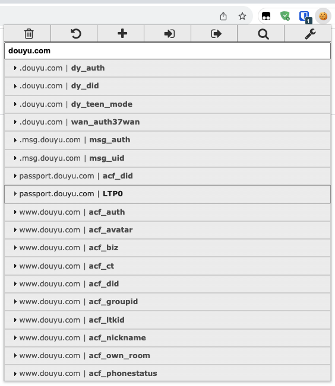

# Douyu-Task


## Config

- `global` [doc](https://github.com/starudream/go-lib/blob/v2/README.md) - [example](https://github.com/starudream/go-lib/blob/v2/app.example.yaml)

```yaml
# 计划任务
cron:
  # 刷新背包荧光棒，每天 00:10:00 获取一次
  refresh: "0 10 0 * * *"
  # 送免费的荧光棒续牌子，每天 23:50:00 执行一次，如果有荧光棒当天过期则按照配置的顺序送出
  renewal: "0 50 23 * * *"

# 基本配置
douyu:
  # 必填，cookie: dy_did
  did: xxx
  # 必填，cookie: ltp0，建议使用无痕模式获取，不影响其他登录状态（issues#28）
  ltp0: xxx

  # 每日登录直播间号
  room: 9999

  # 无视免费礼物过期时间，默认关闭
  ignore_expired_check: false

  # 荧光棒分配
  assigns:
    # { room, count, all }
    # room 直播间号，如果是 0 的话，对已有牌子的直播间分别送上 count 数量的荧光棒
    # count 荧光棒数量
    # all 是否全部分配，建议最后一个直播间设置为 all: true，这样就可以把剩余的荧光棒全部分配出去
    - count: 1
    - room: 99999
      count: 10
    - room: 9999
      all: true
```

### Cookie

- `cookie` use [EditThisCookie](https://www.editthiscookie.com/) extension.

  

### Migrate V2 to V3

- use `douyu.ignore_expired_check` instead of `withOutTimeCheck`

- `ntfy` [see more](https://pkg.go.dev/github.com/starudream/go-lib/ntfy/v2#Config)

## Usage

```
> douyu-task -h
Usage:
  douyu-task [command]

Available Commands:
  cron        Run as cron job
  run         Run douyu job manually

Flags:
  -c, --config string   path to config file
  -h, --help            help for douyu-task
  -v, --version         version for douyu-task

Use "douyu-task [command] --help" for more information about a command.
```

### Run job

#### Refresh

```shell
douyu-task run refresh
```

#### Badge

```shell
douyu-task run badge list
```

#### Gift

```shell
douyu-task run gift list
douyu-task run gift send <room id> <gift id> <count>
```

### Run Cron

```shell
douyu-task cron
```

## Docker Compose

```yaml
version: "3"
services:
  douyu:
    image: starudream/douyu-task
    container_name: douyu
    restart: always
    command: /douyu-task -c /douyu/app.yaml cron
    volumes:
      - "./douyu/:/douyu"
    environment:
      DEBUG: "true"
      app.log.console.level: "info"
      app.log.file.enabled: "true"
      app.log.file.level: "debug"
      app.log.file.filename: "/douyu/app.log"
      app.cron.refresh: "0 10 0 * * *"
      app.cron.renewal: "0 50 23 * * *"
      app.douyu.did: "foo"
      app.douyu.ltp0: "foo"
      app.douyu.room: "9999"
```

## [License](./LICENSE)
